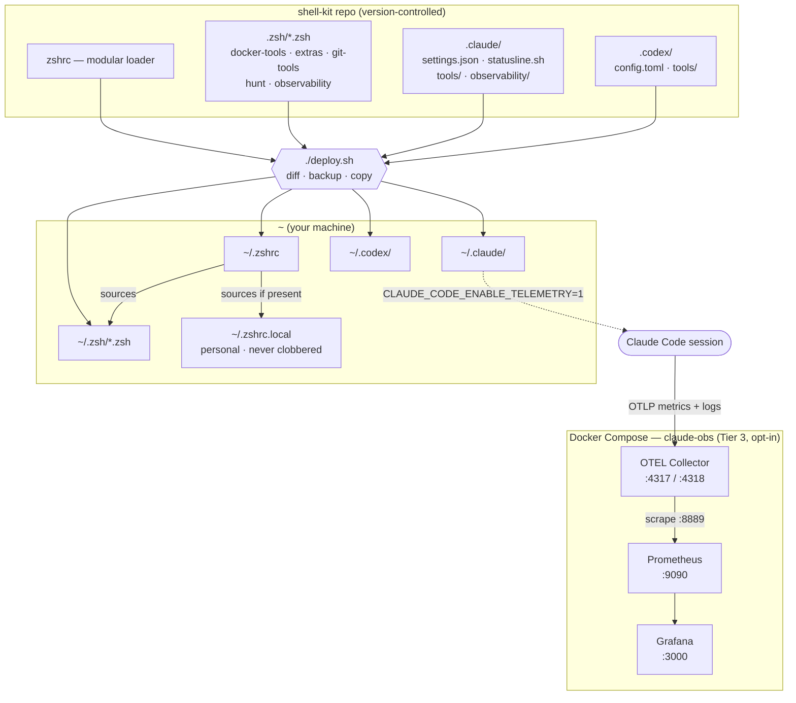

# shell-kit

Modular zsh configuration + AI coding assistant settings for macOS.

## What's Included

- **Zsh configuration** - Git worktree commands, Docker aliases, unified search with `hunt`
- **Claude Code settings** - Permissions, telemetry, per-project env loading, statusline
- **Observability** - Token/cost accounting in the session analyzers + an optional local
  Grafana stack for cross-session trends
- **Codex settings** - Config and session analyzer (token + cost, at parity with Claude)

## Architecture

Two flows come together here: a **deploy flow** that assembles your `~/.zshrc` and Claude/Codex
config from version-controlled modules, and a **telemetry flow** where every Claude Code
session streams tokens/cost into a local Prometheus + Grafana stack running in Docker Compose.



- **Deploy flow (top):** `./deploy.sh` diffs, backs up, then copies the repo's `zshrc`, `.zsh/`
  modules, and `.claude/` + `.codex/` config into your home directory. Your `~/.zshrc` sources
  every `.zsh/*.zsh` module plus your private `~/.zshrc.local` (personal aliases/exports that
  `deploy.sh` never overwrites).
- **Telemetry flow (bottom):** with telemetry enabled in `~/.claude/settings.json`, each Claude
  Code session exports OTLP to the local **Docker Compose** stack — **OTEL Collector →
  Prometheus → Grafana** — brought up on demand with `claude-telemetry up`. When the stack is
  down (or Docker isn't installed) the export silently no-ops with zero session impact.

## Requirements

- macOS
- `fd`, `rg` (ripgrep)
- Optional: `fzf`, `bat`, `eza`, `starship`, `gh`

## Installation

```bash
git clone https://github.com/bikramkgupta/shell-kit.git
cd shell-kit
./deploy.sh
source ~/.zshrc
```

## Quick Reference

```bash
ghelp                          # Git/worktree commands
dkhelp                         # Docker commands
hunt -h                        # Search commands
claude-session-analyzer --help # Claude session viewer (tokens + cost estimate)
codex-session-analyzer --help  # Codex session viewer (tokens + cost estimate)
claude-telemetry help          # Local OTEL + Grafana stack control
```

## Observability

The goal is to answer two questions at any time: *am I improving?* and *what did this task
or session cost, broken down?* Three tiers, escalating from zero-setup to durable dashboards:

| Tier | Tool | Answers |
|------|------|---------|
| 1 — live | `/usage`, `/cost`, `statusline.sh` | current session tokens & cost, at a glance |
| 2 — offline | `claude-session-analyzer --latest --digest` | per-session / per-agent / per-model token + cost |
| 3 — historical | `claude-telemetry up` → Grafana at `localhost:3000` | cost/token trends across many sessions |

Cost figures from the analyzers are **estimates** from an embedded pricing table; `/cost` and
the Usage API are authoritative. Full rationale and usage: [`docs/OBSERVABILITY.md`](docs/OBSERVABILITY.md).

## License

MIT
