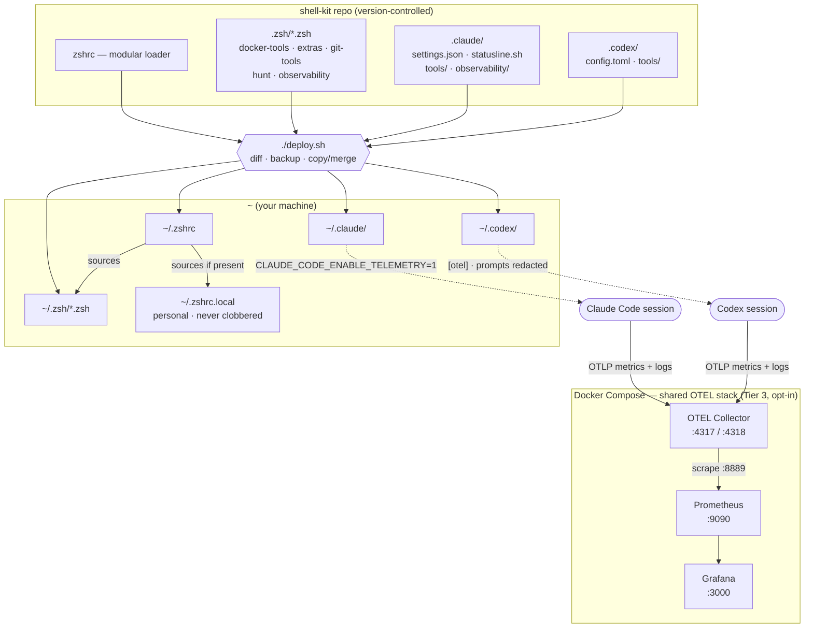

# shell-kit

Modular zsh configuration + AI coding assistant settings for macOS.

## What's Included

- **Zsh configuration** - Git worktree commands, Docker aliases, unified search with `hunt`
- **Claude Code settings** - Permissions, telemetry, per-project env loading, statusline
- **Observability** - Claude Code + Codex token/agent analysis and an optional shared
  OpenTelemetry + Grafana stack for cross-session trends
- **Codex settings** - Safely merged config, native OTEL export, and a current session analyzer

## Architecture

Two flows come together here: a **deploy flow** that assembles your `~/.zshrc` and Claude/Codex
config from version-controlled modules, and a **telemetry flow** where Claude Code and Codex
stream native OTLP data into one local Prometheus + Grafana stack.



- **Deploy flow (top):** `./deploy.sh` diffs, backs up, then copies the repo's `zshrc`, `.zsh/`
  modules, and `.claude/` files into your home directory. It merges shell-kit's model/OTEL
  keys into `~/.codex/config.toml`, preserving app-managed projects, plugins, MCP servers,
  notifications, and permissions. Your `~/.zshrc` sources
  every `.zsh/*.zsh` module plus your private `~/.zshrc.local` (personal aliases/exports that
  `deploy.sh` never overwrites).
- **Telemetry flow (bottom):** Claude Code uses the env block in `~/.claude/settings.json`;
  Codex uses the native `[otel]` block in `~/.codex/config.toml` with raw prompts disabled.
  Both export to **OTEL Collector → Prometheus → Grafana**, started with `ai-telemetry up`
  (`claude-telemetry` and `codex-telemetry` are compatible names).

## Requirements

- macOS
- `fd`, `rg` (ripgrep)
- Optional: `fzf`, `bat`, `eza`, `starship`, `gh`

## Installation

```bash
git clone https://github.com/bikramkgupta/shell-kit.git
cd shell-kit
./deploy.sh
source ~/.zshrc
```

## Quick Reference

```bash
ghelp                          # Git/worktree commands
dkhelp                         # Docker commands
hunt -h                        # Search commands
claude-session-analyzer --help # Claude session viewer (tokens + cost estimate)
codex-session-analyzer --help  # Codex session viewer (tokens + cost estimate)
ai-telemetry help              # Shared Claude Code + Codex OTEL/Grafana stack
```

## Observability

The goal is to answer two questions at any time: *am I improving?* and *what did this task
or session cost, broken down?* Three tiers, escalating from zero-setup to durable dashboards:

| Tier | Tool | Answers |
|------|------|---------|
| 1 — live | native client usage/context UI | current task at a glance |
| 2 — offline | `claude-session-analyzer` / `codex-session-analyzer` | per-task / per-agent / per-model tokens and estimated cost |
| 3 — historical | `ai-telemetry up` → Grafana at `localhost:3000` | token/model/tool/agent trends across tasks |

Cost figures are **API-rate estimates** for publicly priced model IDs. Private Codex model
slugs show `N/A` instead of borrowing a guessed price. Provider billing and subscription
usage are authoritative. Full rationale: [`docs/OBSERVABILITY.md`](docs/OBSERVABILITY.md).

## License

MIT
